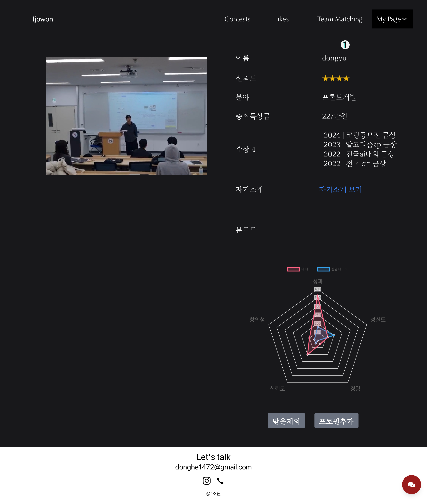
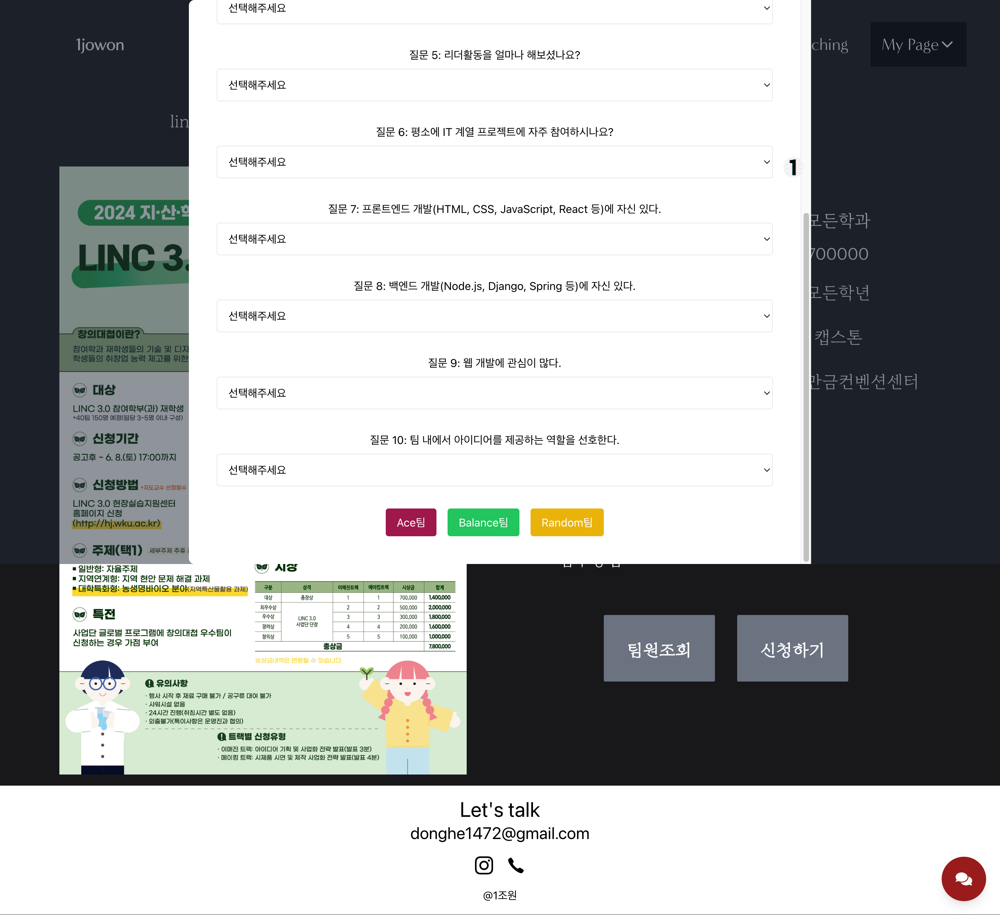

# AI 기반 팀 매칭 웹사이트

## 소개

AI 기반 팀 매칭 웹사이트에 오신 것을 환영합니다! 우리 플랫폼은 인공지능을 활용하여 다양한 대회와 프로젝트에 적합한 팀을 매칭해 줍니다. 각 팀이 잘 균형 잡히고 성공 가능성이 높도록 구성됩니다. 이 README는 웹사이트의 기능, 설정 및 사용법을 안내합니다.

## 기능

1. **대회 목록 및 크롤링**

   - 우리 웹사이트는 다양한 대회의 목록을 제공하며, 정기적으로 웹 크롤링을 통해 업데이트됩니다.
   - 

2. **AI가 분석한 팀 매칭**

   - 인공지능이 각 참가자의 장단점을 분석하여 최적의 팀을 구성합니다.
   - 

3. **팀원의 장점을 파악하여 부족한 점 보완**

   - 각 팀원의 장점을 파악하고, 부족한 점을 보완해 줄 수 있는 팀원을 매칭합니다.
   - 

4. **수업에서도 활용 가능한 재미있는 팀 매칭**

   - 수업에서도 활용할 수 있는 재미있고 효율적인 팀 매칭 기능을 제공합니다.
   - 

5. **나의 능력치를 한눈에 보기 쉽게**
   - 사용자의 능력치를 한눈에 볼 수 있는 기능을 제공합니다.
   - 

## 작동 원리

1. 사용자들이 대회에 참가 신청을 합니다.
2. 인공지능이 참가자의 프로필과 능력을 분석합니다.
3. 분석 결과를 바탕으로 최적의 팀을 구성합니다.
4. 팀원 간의 소통과 협력을 도와주는 다양한 도구를 제공합니다.

## 기술 스택

- 프론트엔드: HTML, CSS, JavaScript, React
- 백엔드: Django Rest Api
- 데이터베이스: SQL DB
- 인공지능: Python, TensorFlow

## 설치 및 설정

1. 저장소를 클론합니다:
   ```bash
   git clone https://github.com/your-repo/team-matching.git
   ```
2. 프로젝트 디렉토리로 이동합니다:
   ```bash
   cd team-matching
   ```
3. 필요한 패키지를 설치합니다:
   ```bash
   npm install
   ```
4. 서버를 시작합니다:
   ```bash
   npm start
   ```

## 사용법

1. 웹사이트에 접속하여 계정을 생성합니다.
2. 대회 목록에서 참여하고 싶은 대회를 선택합니다.
3. Ace, Balance, Random 매칭중 선택해 참가 신청을 하고 팀 매칭을 기다립니다.
   - 
4. 매칭된 팀원들과 소통하며 프로젝트를 진행합니다.

## 기여

1. 이 프로젝트에 기여하고 싶다면, 이슈를 생성하거나 풀 리퀘스트를 보내주세요.
2. 자세한 기여 방법은 `CONTRIBUTING.md` 파일을 참조하세요.

## 라이선스

이 프로젝트는 MIT 라이선스 하에 배포됩니다. 자세한 내용은 `LICENSE` 파일을 참조하세요.
